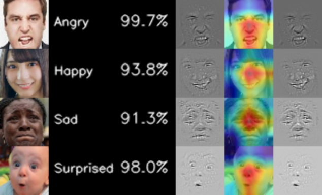

# pytorch-facial-expression-recognition

Lightweight facial emotion recognition.

* Pytorch implementation for [Mini Xception](https://arxiv.org/pdf/1710.07557.pdf) inspired by [Keras implementation](https://github.com/oarriaga/face_classification).
* Model size is about `250KB`

## Trained Model

Trained by FER2013 dataset.

* Private Data : 66%
* Public Data : 64%

Here is the result of sample image.  
Emotion | Probability | Guided Backprop | Grad-Cam | Guided Grad-Cam



## Retrain

1. see [here](./dataset/README.md) to prepare dataset.

2. execute train.py
```
cd src
python train.py
python check.py  #check.py supports cpu only
```

## Reference

* [Grad-CAM](https://github.com/kazuto1011/grad-cam-pytorch)
* [Data Augmentation / Optimizer](https://github.com/WuJie1010/Facial-Expression-Recognition.Pytorch)
